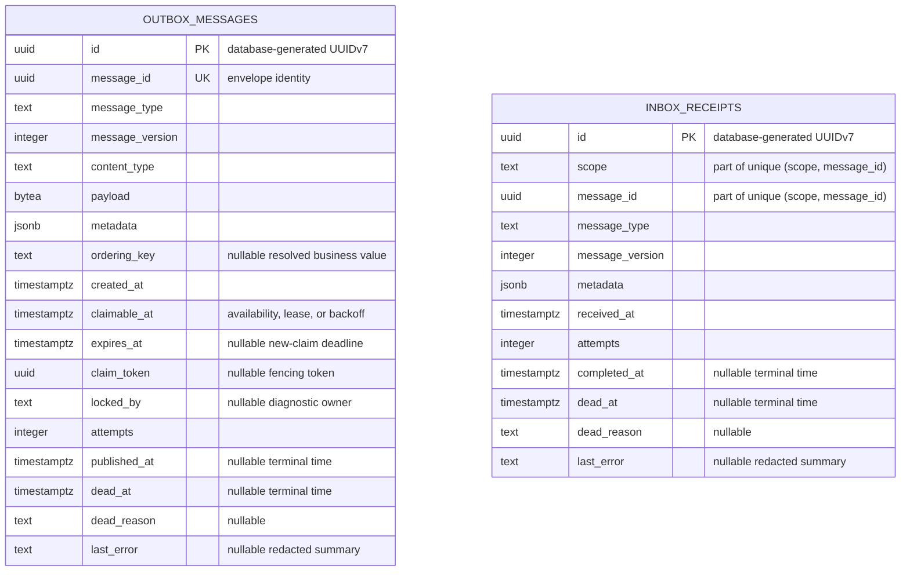

# PostgreSQL design

## 1. Baseline

The repository begins with the executable schema baseline in
[`../migrations/0001_messaging.sql`](../migrations/0001_messaging.sql).
`ck_outbox_messages_claim` requires `claim_token` and `locked_by` to be null or non-null together,
while `ck_outbox_messages_terminal_claim` prevents a terminal row from retaining either value.
Every valid transition maintains both invariants. Both metadata columns must contain a JSON object.
These checks make corrupt state fail at its write boundary without adding another runtime query.

- PostgreSQL 18 or later is required for `uuidv7()`.
- `timestamptz` is used for every timestamp.
- Database time (`now()`) governs claims, leases, backoff, expiry, completion, death, retention,
  and cursor order.
- Identifiers in runtime SQL are static and unqualified.
- The application configures `search_path` so the intended schema resolves first.
- Table names are fixed: `outbox_messages` and `inbox_receipts`.
- Every supporting index is created explicitly and named `ix_<table>_<purpose>`, including unique
  indexes. Uniqueness is enforced with `CREATE UNIQUE INDEX`; the database does not choose an
  index name on the library's behalf.
- Released migrations are immutable and forward-only.

Atlas Community Edition applies the repository's versioned SQL migrations from `migrations/`.
Migration is a deployment concern: no SQL is embedded in a Rust crate, no crate exposes a
`migrate` API, and store construction never migrates, probes, or opens a connection. SQLx remains
the runtime database client and may retain offline query metadata; its migration feature is not
enabled.

### Entity-relationship diagram



The tables are intentionally independent and have no foreign key between them. The inbox unique
key is the composite `(scope, message_id)` pair; matching `message_id` values across the two tables
express message identity, not relational ownership. Check constraints and partial access-path
indexes remain normative in the migration and the sections below rather than being approximated as
ER relationships.

## 2. Outbox model

`outbox_messages` contains one durable publication request per application transaction.

### Identity and payload

- `id`: database-generated UUIDv7 row identity and deterministic tiebreaker between rows that
  resolved to the same ordering key.
- `message_id`: envelope identity and broker deduplication key; unique within the outbox.
- `message_type` and `message_version`: stable application contract identity.
- `content_type` and `payload`: bytes produced by the configured serializer.
- `metadata`: additive JSON metadata and custom headers.
- `ordering_key`: the business value returned by `Message::order_by`; it is promoted because the
  claim query gates on it.
- `expires_at`: deadline for starting another claim, not a revocation of publication already in
  flight.

Only values needed by SQL predicates or decoding fundamentals are promoted. Tenant and
correlation data remain in `metadata`; adding a business metadata field does not require a table
migration.

### Lease

The lease has three columns:

- `locked_by`: which dispatcher holds it, for diagnostics only;
- `claim_token`: which claim owns it, the fencing value used by every outcome write;
- `claimable_at`: when another claim may take it.

`claimable_at` serves three mutually exclusive purposes: initial availability, lease deadline,
and retry-backoff deadline. A second lease timestamp is deliberately absent.

`claim_token` and `locked_by` must be both null or both non-null. A renewal moves
`claimable_at` without rotating the token. Complete, fail, dead, and release operations clear the
token and owner.

### Derived state

State is never stored as a status column:

```sql
CASE
  WHEN dead_at IS NOT NULL THEN 'dead'
  WHEN published_at IS NOT NULL THEN 'published'
  WHEN locked_by IS NOT NULL AND claimable_at > now() THEN 'leased'
  WHEN expires_at IS NOT NULL AND expires_at <= now() THEN 'expired'
  WHEN claimable_at > now() THEN 'backing_off'
  ELSE 'pending'
END
```

A stored `leased` value would become false when time passes without any write. Timestamps are the
source of truth.

### State transitions

| Operation | Predicate | Mutation |
|---|---|---|
| Enqueue | new `message_id` | insert; `claimable_at = now()` |
| Claim | non-terminal, due, unexpired, ordering head | set owner, new token, `claimable_at = now() + lease` |
| Renew | matching `id + claim_token` | move `claimable_at`; retain owner and token |
| Complete | matching `id + claim_token` | increment attempts, set `published_at`, clear claim |
| Retry | matching `id + claim_token` | increment attempts, store safe error, set backoff, clear claim |
| Dead | matching `id + claim_token` | increment attempts, set death fields, store safe error, clear claim |
| Release | matching `id + claim_token` | set `claimable_at = now()`, clear claim; do not increment attempts |
| Expire | terminal-null, expired, not actively leased | set dead with reason `expired`, clear claim |
| Retry dead | dead row selected by operator | clear death fields, reset attempts, set due now, clear claim |
| Purge | published/dead older than retention | bounded delete |

`attempts` counts recorded publish outcomes, not claims. A worker crash before a publish outcome
does not consume the retry budget.

An attempt claimed before `expires_at` may finish afterward. The expiry sweep does not race an
active lease, and no database transition can retract a message that the broker may already have
accepted. Expiry prevents new claims after the deadline; it is not a hard delivery cutoff.

Every claim-ending worker write matches `claim_token`. A row-count shortfall is a benign fencing
result: the caller lost that claim and must not overwrite the newer owner.

## 3. Per-key ordering

`Message::order_by` resolves an optional business key when the envelope is created. That resolved
value is persisted verbatim as `ordering_key`; PostgreSQL does not derive it from the message ID or
row ID.

An unordered row (`ordering_key IS NULL`) competes normally under `SKIP LOCKED`. For rows whose
resolved `ordering_key` values are equal, a row is claimable only when it has the lowest UUID row
ID among the non-terminal, unexpired rows for that key. This prevents concurrent publication
within one key and gives the stored rows a deterministic tiebreak order.

It does not guarantee transaction commit order or a business-domain sequence. PostgreSQL UUIDv7
values contain a millisecond timestamp and are therefore time-correlated, but their remaining bits
do not form a strict insertion sequence. Rows can also be inserted through different pool
connections, and transaction visibility is independent of UUID generation. A domain that requires
a strict externally meaningful sequence needs an explicit application sequence and a corresponding
schema/query extension.

Lease expiry, operator resurrection of a dead predecessor, broker behavior, duplicate delivery,
and consumer concurrency can still produce downstream reordering. The library promises only the
claim gate described above.

## 4. Inbox model

`inbox_receipts` is evidence that a consumer scope has seen and processed a message. It is not an
archive and stores no payload.

- `id`: database-generated UUIDv7 operator handle and dead-letter cursor tiebreaker.
- `(scope, message_id)`: unique deduplication identity.
- message identity and metadata: enough for diagnostics, filtering, and trace continuity.
- `received_at`: first persisted observation.
- `attempts`, `completed_at`, `dead_at`, `dead_reason`, `last_error`: processing outcome.

State is derived:

```sql
CASE
  WHEN dead_at IS NOT NULL THEN 'dead'
  WHEN completed_at IS NOT NULL THEN 'completed'
  WHEN attempts > 0 THEN 'retrying'
  ELSE 'pending'
END
```

Inbox claim and completion run in the caller's transaction. A transaction-scoped advisory lock
guards concurrent processing of the same `(scope, message_id)`. It is released automatically on
commit or rollback.

Failure recording happens after the handler transaction is rolled back, using the store's pool.
It increments the attempt and atomically makes a permanent failure dead immediately or a transient
failure dead at `max_attempts`. The attempt count is consequently a lower bound: a crash before
failure recording loses the bookkeeping, not the message.

### Retention decision

Only completed and dead receipts are automatically retention-purged. Incomplete/retrying receipts
are not purged by age.

The schema has no non-terminal activity timestamp. Deleting a non-terminal receipt merely because
its original receive time is old can remove the only evidence of a repeatedly failing handler.
Operators decide whether to retry or delete dead receipts explicitly.

## 5. Metadata JSON contract

Both tables use an additive JSON object with the same conceptual shape:

```json
{
  "correlation": {
    "correlation_id": "checkout-42",
    "conversation_id": "019...",
    "causation_id": "019...",
    "request_id": "019..."
  },
  "trace": {
    "traceparent": "00-...",
    "tracestate": "vendor=value"
  },
  "routing": {
    "source": "orders-api",
    "destination": "fulfilment",
    "reply_to": "orders-api"
  },
  "delivery": {
    "sent_at_ms": 1789056000000,
    "deduplication_id": "order-42-v1"
  },
  "tenant_id": "acme",
  "headers": {
    "x-import-batch": "2026-09-11"
  }
}
```

Rules:

- Missing keys mean absent/default values.
- Unknown keys are ignored so rolling upgrades work in both directions.
- There is no `metadata_version` column or JSON field.
- `content_type`, `expires_at`, and `ordering_key` are not duplicated in JSON because they have
  authoritative outbox columns.
- The inbox may omit delivery or routing fields it did not receive.
- Header names and values are validated before persistence.
- Decoding malformed known values never panics. An undecodable outbox row becomes dead with
  reason `undecodable`; an unreadable operator row is returned as a poisoned entry rather than
  silently skipped.
- No GIN index is created by default. JSON filters are operator queries, not hot-path predicates.
  Add measured expression indexes in a later migration only when a real query requires them.

## 6. Query-to-index contract

| Operation | Primary predicate/order | Index |
|---|---|---|
| Outbox enqueue dedup/find | `message_id = ?` | `ix_outbox_messages_message_id` |
| Outbox claim | active, `claimable_at <= now()`, order by `(claimable_at, id)` | `ix_outbox_messages_claimable` |
| Ordering head | `ordering_key = ?`, active, order by `(ordering_key, id)` | `ix_outbox_messages_ordering_key` |
| Expiry sweep | active, `expires_at <= now()` | `ix_outbox_messages_expires` |
| Published retention | `published_at < cutoff` | `ix_outbox_messages_published` |
| Outbox dead page/purge | order/filter by `(dead_at, id)` | `ix_outbox_messages_dead_cursor` |
| Inbox dedup | `(scope, message_id)` | `ix_inbox_receipts_scope_message_id` |
| Inbox completed retention | `completed_at < cutoff` | `ix_inbox_receipts_completed` |
| Inbox dead page/purge | order/filter by `(dead_at, id)` | `ix_inbox_receipts_dead` |

Every hot query receives a real-PostgreSQL plan test. Indexes are not added for hypothetical
queries, and unit tests do not substitute for concurrency and query-plan tests.

## 7. Connection and timeout policy

`PostgresOutboxStore` and `PostgresInboxStore` own application-supplied `PgPool` values.

- Application-owned transaction methods receive `&mut Transaction<'_, Postgres>` or the narrow
  executor form required by SQLx.
- Provider-owned operations execute directly against `&PgPool`.
- Shared query helpers accept `impl PgExecutor` when doing so genuinely serves both contexts.
- The application configures `search_path` and server-side `statement_timeout` through role,
  database, connection options, or pool initialization.
- Dispatcher `store_timeout` is a client-side runtime bound; it does not require wrapping every
  statement in a transaction.

Direct pool/executor use avoids extra round trips and unnecessary lifetime machinery, behaves
correctly behind transaction-mode poolers, and makes connection ownership obvious.

## 8. Migration operations

The deployment contract uses the Apache-2.0 Atlas Community CLI and a linear, versioned migration
directory. [Migration lifecycle](migrations.md) defines development, CI, public distribution, and
production ownership:

- `migrations/` and `migrations/atlas.sum` are committed. Released migration files are never
  edited, removed, or reordered.
- Operators use `atlas migrate apply` and `atlas migrate status` against an
  application-selected schema. Database URLs and credentials are deployment inputs and are not
  committed.
- Atlas records applied files and statements in `atlas_schema_revisions`. `atlas.sum` protects
  migration-directory integrity; neither is live-schema drift detection.
- CI regenerates the checksum, reapplies the complete directory to an empty PostgreSQL 18
  database, and runs integration and query-plan tests.
- Only a dedicated migration role owns DDL. Runtime roles do not, and manual production DDL is
  prohibited. These controls compensate for Community Edition not including drift detection,
  linting, pre-migration checks, or declarative plan validation.
- A failed production change is repaired by a new forward migration. Development and test
  databases may be recreated. The workflow does not depend on `migrate down`, which Community
  Edition does not provide.

Direct declarative `schema apply` is not a deployment mechanism. Because it computes SQL from the
live target at execution time, drift can produce a different plan in each environment.
Declarative diffing may propose SQL locally, but a reviewed versioned SQL file is the artifact that
ships.

The empty-database baseline uses ordinary transactional index creation. A later index build on a
large live table uses a dedicated migration:

```sql
-- atlas:txmode none
CREATE INDEX CONCURRENTLY ix_outbox_messages_example
    ON outbox_messages (example_column);
```

Put one concurrent index build in each non-transactional migration. PostgreSQL can leave an
invalid index after a failed concurrent build, so the deployment runbook checks
`pg_index.indisvalid`, drops or concurrently rebuilds an invalid index, and retries. `IF NOT
EXISTS` must not hide an invalid index with the intended name.

Checkpoints are an optional fresh-install replay optimization, not a correctness requirement.
Community Edition does not generate them. If replay time becomes a measured problem, the project
may introduce a separately reviewed baseline strategy without rewriting released history.

For review or desired-schema snapshot generation, follow the canonical
[snapshot procedure](migrations.md#7-desired-schema-snapshot): apply the complete versioned
directory to a clean, disposable PostgreSQL 18 database, confirm its migration status, and inspect
only that database. The resulting snapshot is a generated artifact, not a migration or Atlas
checkpoint, and is never added to the migration directory. Comparing a live target with this
desired state is a separate operator procedure using `atlas schema diff`; the snapshot commands
never inspect a live target. PostgreSQL `pg_dump --schema-only` is used instead when objects outside
the Community schema model must be captured.

## 9. Standards references

- [PostgreSQL 18 UUID functions](https://www.postgresql.org/docs/18/functions-uuid.html)
- [PostgreSQL UUIDv7 implementation](https://github.com/postgres/postgres/blob/master/src/backend/utils/adt/uuid.c)
- [Atlas Community Edition feature matrix](https://atlasgo.io/community-edition)
- [Atlas versioned migration apply](https://atlasgo.io/versioned/apply)
- [PostgreSQL concurrent index builds](https://www.postgresql.org/docs/18/sql-createindex.html#SQL-CREATEINDEX-CONCURRENTLY)
