# Runtime flows

## 1. Durable outbox enqueue

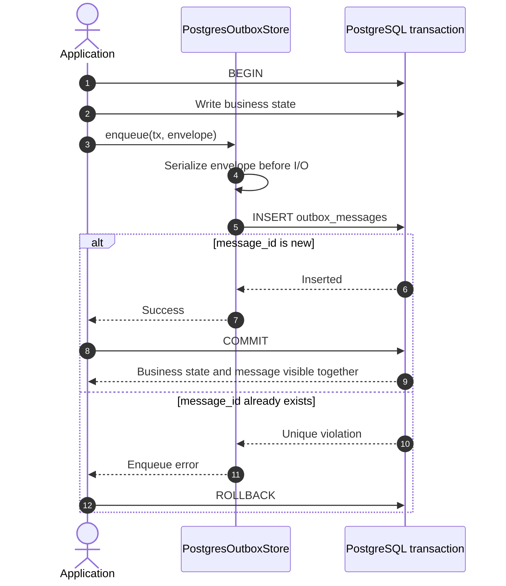

The application owns the transaction. Enqueue performs serialization before awaiting the insert,
executes one insert, and never commits, rolls back, retries, sleeps, or publishes.

A reused `message_id` is an error. With PostgreSQL it aborts the caller's transaction, preventing a
business write from committing without the corresponding new message.

Calling a transport `Publisher` directly is a different operation: it sends immediately, does not
join the database transaction, and receives none of the outbox guarantees.

## 2. Outbox dispatch

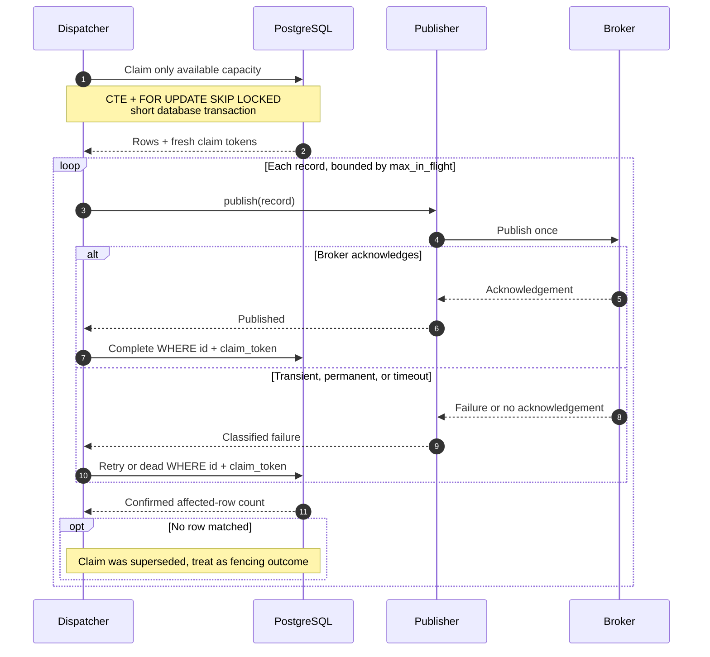

### Claim

The dispatcher claims only enough rows to fill available `max_in_flight` capacity. A claim:

1. selects active, due, unexpired rows;
2. applies the per-key head condition when `Message::order_by` resolved an `ordering_key`; the
   stored UUIDv7 row ID only breaks ties between rows with that same key;
3. locks candidates with `FOR UPDATE SKIP LOCKED`;
4. stamps each row with `locked_by`, a fresh database-generated `claim_token`, and
   `claimable_at = now() + lease`;
5. returns the rows after the statement commits.

Publication never occurs while a row lock or database transaction is held.

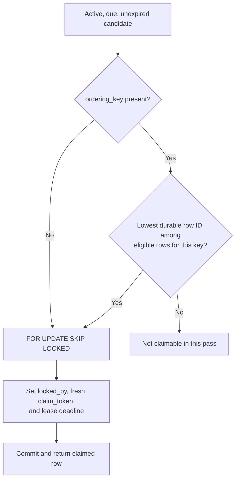

### Publish and outcome

Each claimed message is published with bounded concurrency and an explicit timeout. The publisher
returns only after the broker acknowledges the operation or a classified failure occurs. It does
not retry internally; the outbox retry policy owns retry scheduling.

- Acknowledged publish: `complete` increments `attempts`, sets `published_at`, and clears the
  claim.
- Transient failure with retry budget: `fail` increments `attempts`, records a safe error summary,
  moves `claimable_at` by the retry delay, and clears the claim.
- Permanent failure or exhausted attempts: `fail` increments `attempts`, sets `dead_at` and
  `dead_reason`, records a safe error summary, and clears the claim.
- Lost claim: an outcome statement affects no row. This is normal fencing, not a store error.

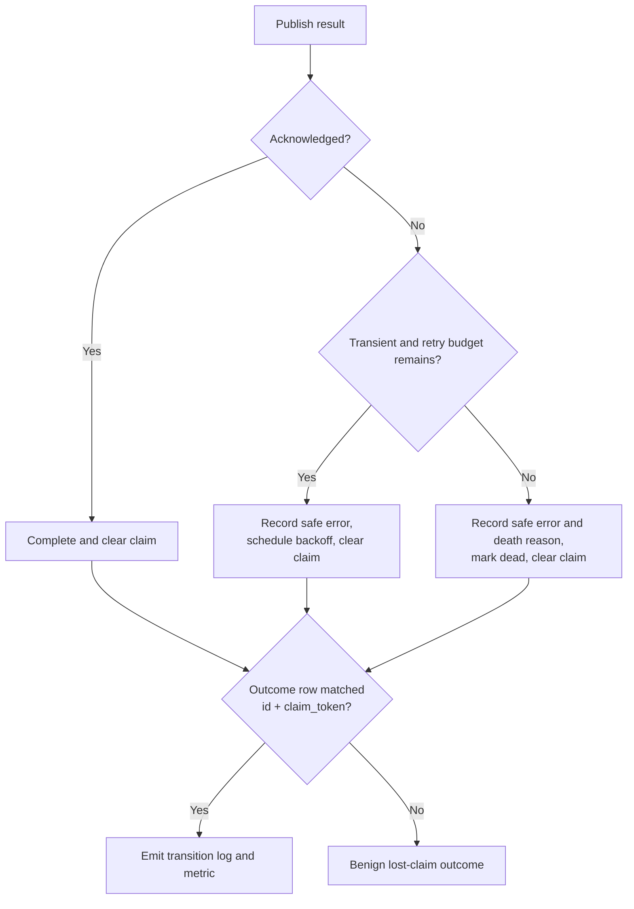

Metrics and state-transition logs are emitted only after the database confirms the affected rows.
Database backlog gauges remain authoritative because a committed write can succeed while its
client acknowledgement is lost.

### Lease renewal

While a publish is unresolved, renewal runs before the lease can expire. Renewal uses the original
claim token and moves only `claimable_at`. A shortfall means another claim already superseded this
one.

`store_timeout` must remain below half the lease. Every dispatcher loop turn performs at most one
bounded external store call before polling lease readiness again.

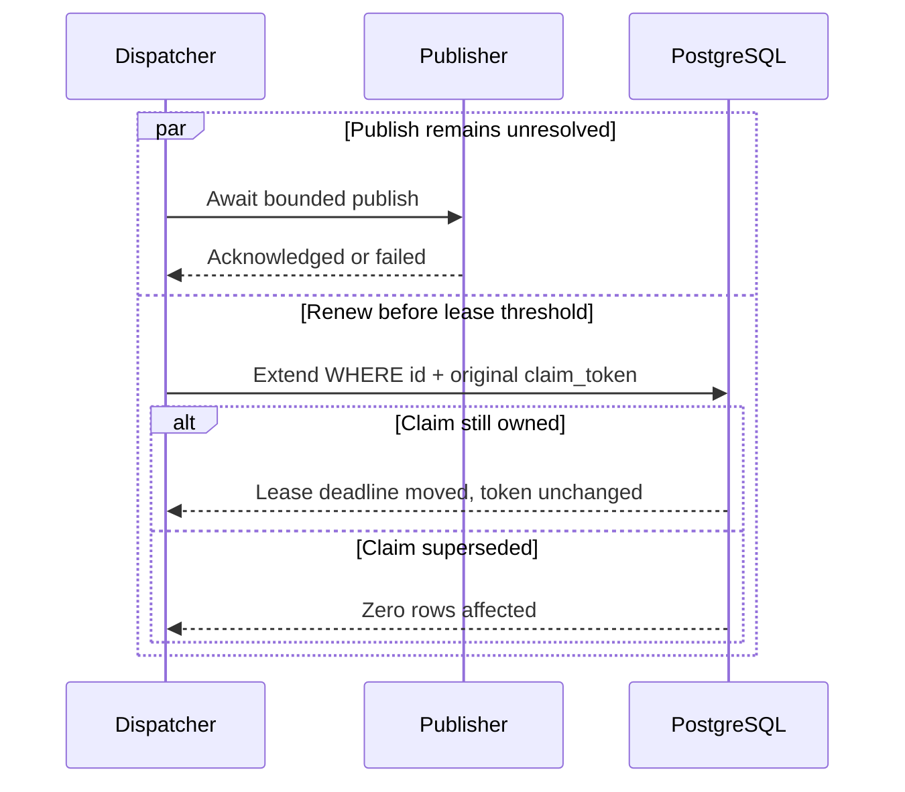

### Poison rows

Failure to decode one database row does not fail the batch. The provider returns healthy records,
reports the unreadable row as poisoned, and attempts to mark it dead with `undecodable`, fenced by
the claim token. If that follow-up fails after the claim committed, the claim result is still
returned and the row is retried after its lease lapses.

## 3. Duplicate windows

At-least-once publication necessarily permits duplicates:

1. **Publish/complete crash:** the broker accepts the message, then the worker dies before the
   database records completion.
2. **Lease expiry:** publication outlives the lease and another worker reclaims the row.
3. **Shutdown drain:** a publish remains unresolved at the drain deadline and the row is released
   or later reclaimed.
4. **Outcome acknowledgement loss:** PostgreSQL commits completion, but the client does not receive
   confirmation and cannot safely infer the result.

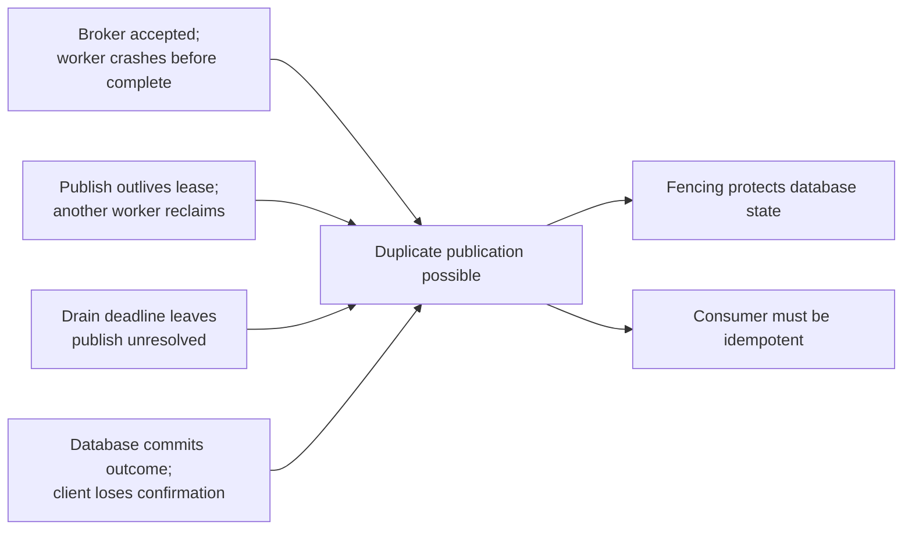

Fencing prevents stale workers from corrupting newer state; it cannot retract a message already
accepted by the broker. Consumers must be idempotent.

## 4. Graceful dispatcher shutdown

On cancellation the dispatcher:

1. stops claiming new rows;
2. releases claimed rows whose publication has not started;
3. waits up to `drain_timeout` for in-flight publishes;
4. persists the outcomes that resolved;
5. releases unresolved claims;
6. returns.

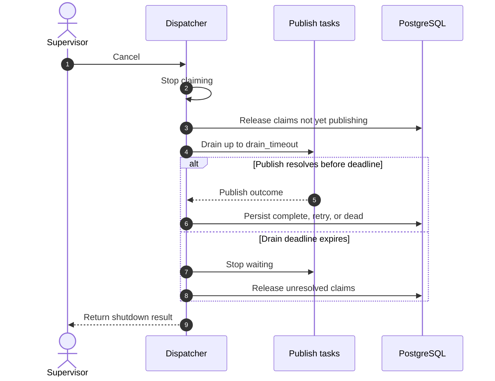

Store calls already executing are allowed to reach their explicit `store_timeout`; they are not
dropped merely because a different `select!` branch became ready.

Worker-loop rule: a `tokio::select!` branch future may only wait for cancel-safe readiness—a
cancellation token, timer, channel receive with defined cancellation behavior, or task join.
Externally visible database and broker I/O happens in the selected arm body.

## 5. Inbox processing

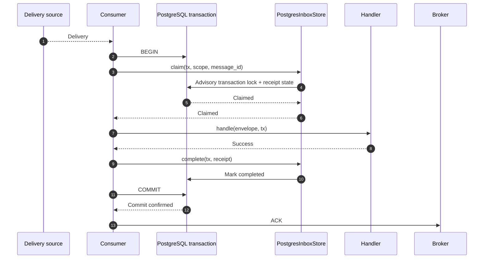

### Claim outcomes

| Outcome | Transaction action | Broker action |
|---|---|---|
| `Claimed` | Run handler; complete; commit | Ack after commit |
| `AlreadyCompleted` | Roll back/drop transaction | Ack |
| `InProgress` | Roll back/drop transaction | NAK with delay |
| `Dead` | Roll back/drop transaction | Terminate; do not redeliver |
| Store error | Roll back | NAK |

The claim uses a transaction-scoped advisory lock for `(scope, message_id)`, then inserts the
receipt or reads its existing state. This prevents two live transactions from executing the same
handler concurrently while allowing completed redeliveries to resolve quickly.

### Handler failure

If the handler fails:

1. roll back the application transaction;
2. call `fail` with the error's `FailureKind` through the store's pool, outside the rolled-back
   transaction;
3. atomically increment `attempts` and transition to dead immediately for a permanent failure or
   when a transient failure reaches `max_attempts`;
4. NAK when recorded for retry, terminate when dead, or ack if another transaction already
   completed the message.

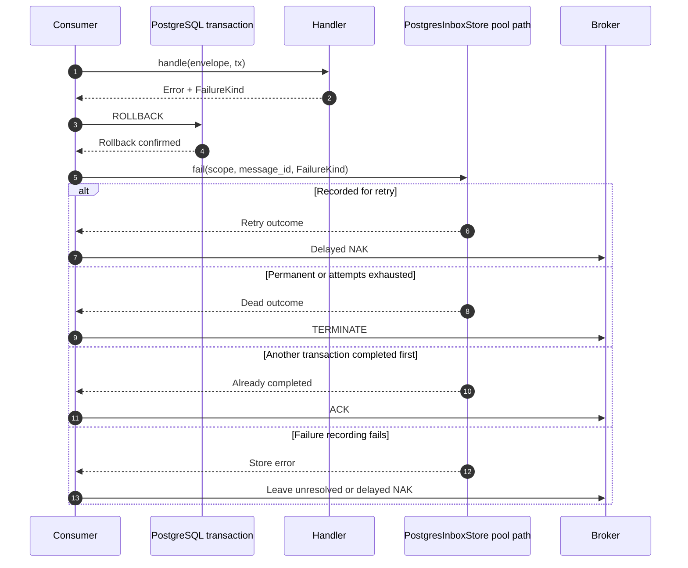

Failure recording is best effort. A crash between rollback and failure recording produces an
uncounted attempt and a later redelivery, never false completion. Ack-before-commit is forbidden
because it converts a commit failure into message loss.

## 6. Consumer framework

For individual delivery (including NATS), the recommended integration delegates the section 5
protocol to `sisa-messaging-consumer`:

```mermaid
flowchart LR
    Receive[Receive delivery] --> Map[Map transport wire data]
    Map --> Decode[Decode typed envelope]
    Decode --> Begin[Begin transaction]
    Begin --> Claim[Claim inbox receipt]
    Claim --> Handle[Run typed handler]
    Handle --> Complete[Complete inbox receipt]
    Complete --> Commit[Commit transaction]
    Commit --> Plan[Create settlement plan]
    Plan --> Settle[Ack, delayed NAK, TERMINATE,<br/>or leave unresolved]
```

The source stops polling at `max_in_flight`. Each received delivery retains its broker settlement
handle while an owned workflow task performs the database and handler work. A coordinator can send
heartbeat acknowledgements while waiting without cancelling or repolling the workflow future.

The individual-delivery workflow returns a private settlement plan:

| Result | Settlement |
|---|---|
| Commit confirmed | Ack |
| Already completed | Ack |
| Another transaction in progress | Delayed NAK |
| Transient handler/store failure | Delayed NAK |
| Permanent or exhausted failure | Terminate |
| Decode poison without safe identity | Terminate |
| Commit result ambiguous | Delayed NAK; never record handler failure |
| Permanent provider/settlement failure | Leave unresolved; stop receiving and return fatal error |

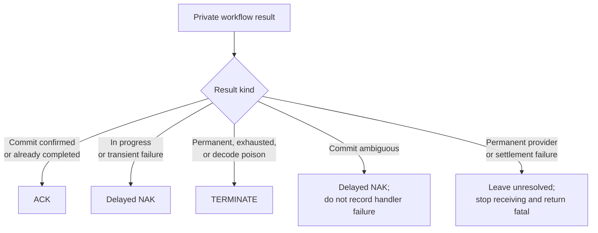

On cancellation it stops receiving, drains already received work for a bounded duration, settles
completed work, then drops remaining transactions and leaves their deliveries unacknowledged for
redelivery. See [Consumer framework](consumer-framework.md) for the API and complete state machine.

Partitioned-log sources use the same inbox transaction outcomes but not the individual-delivery
ACK/NAK/TERMINATE operations above. After a confirmed commit or durable terminal disposition, the
partition workflow may `Advance` its ordered cursor; otherwise it must `LeaveUnresolved`. It never
advances past an earlier unresolved record. Ownership loss is a distinct receive outcome, not a
clean source close: it fences the old settlement generation and blocks that partition until its
cursor and ownership are reconciled. An indeterminate advance similarly pauses only the affected
partition until reconciliation proves whether the cursor moved; other partitions may continue.

## 7. NATS publish

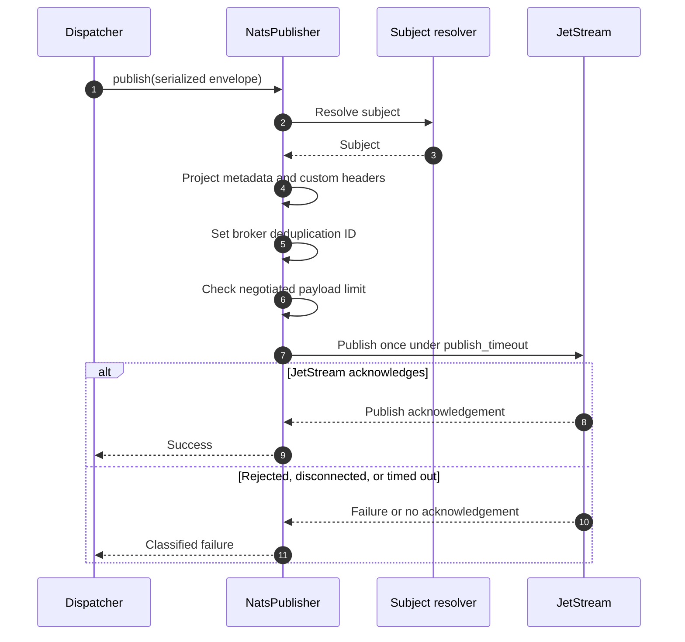

For one `SerializedEnvelope`, the NATS publisher resolves a subject, projects framework metadata
and custom headers, applies the broker deduplication ID, checks the current negotiated payload
limit, publishes once, and awaits the JetStream acknowledgement under `publish_timeout`.

The application owns the NATS client and JetStream context. The library neither connects nor
creates streams or consumers.

## 8. Maintenance

Maintenance is explicit and independently supervised.

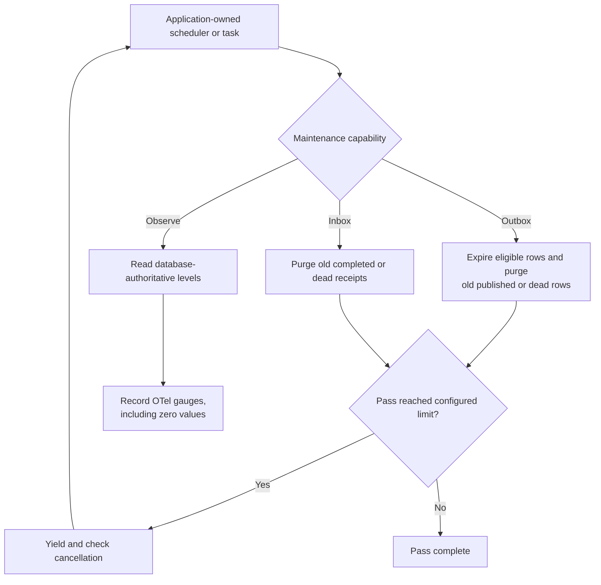

- An outbox purge deletes old published/dead rows and transitions expired, non-terminal,
  non-actively-leased rows to dead.
- An inbox purge deletes old completed/dead receipts and never automatically deletes
  pending/retrying receipts.
- Each call is a bounded pass. The caller repeats while progress reaches the limit, yielding and
  honoring cancellation between passes.
- One application-owned observer per database/schema reads database-authoritative outbox levels
  and records OTel gauges. Statistics are not polled by every dispatcher.
